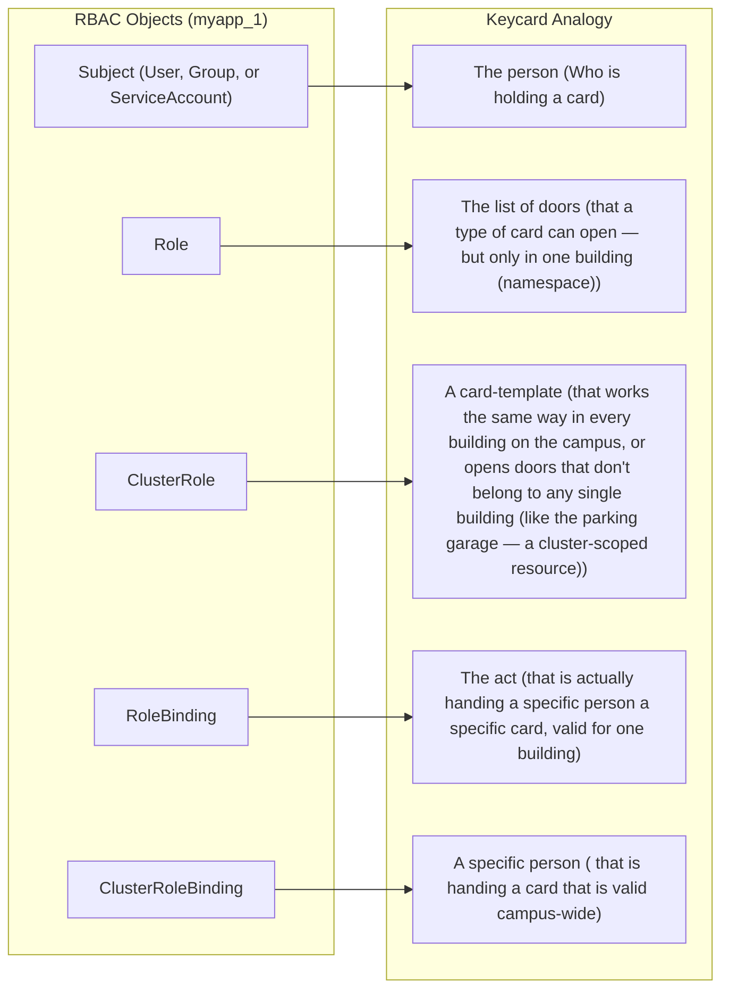
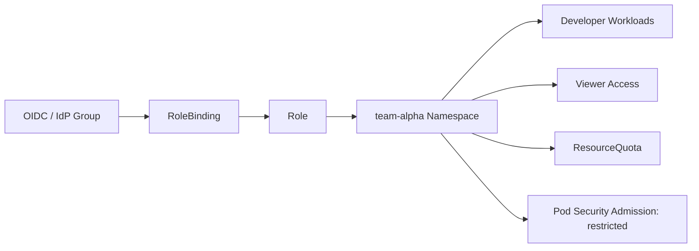
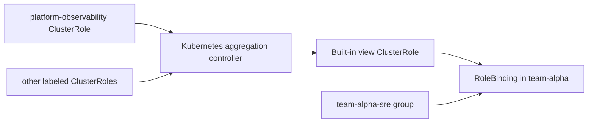

# Project Title: 
###  "Zero-Trust Multi-Tenant Kubernetes: Namespace-Scoped RBAC, Aggregated ClusterRoles, and Least-Privilege Service Accounts"

## Tool versions: 
 - Kubernetes 1.36 (RBAC API rbac.authorization.k8s.io/v1 — stable since 1.8, unchanged surface but the built-in default roles have shifted underneath it), 
 - kubectl 1.36.x, 
 - Pod Security Admission (stable, restricted/baseline/privileged standards), 
 - ValidatingAdmissionPolicy (GA since 1.30, CEL-based)

# What You Will Build
•	Two isolated tenant namespaces (team-alpha, team-beta) with namespace-scoped Role/RoleBinding pairs that give each team exactly what it needs and nothing else
•	A platform-level ClusterRole built the aggregated way — the pattern Kubernetes' own admin/edit/view roles use — instead of one giant hand-written rule list
•	Dedicated ServiceAccounts per application (never the namespace default SA), with automount disabled where it isn't needed
•	A live demonstration of a current, real gotcha in the built-in edit/admin roles that catches teams off guard in production
•	A full audit workflow using kubectl auth can-i and impersonation to prove what an identity can actually do — not what you think it can do

# What is multitenant Kubernetes? 
Multitenant Kubernetes means one Kubernetes cluster is shared by multiple tenants while still keeping their workloads, access, and resources separated enough for safety and control. A tenant can be a team, a project, or a customer in a SaaS platform.

## Core idea
In a single-tenant setup, one cluster is usually dedicated to one app or team. In a multitenant setup, several teams or customers share the same cluster, but Kubernetes policies limit what each tenant can see or do.

The main goal is to balance cost efficiency with isolation. That isolation is usually built with namespaces, RBAC, resource quotas, network policies, and pod security controls.

## Example
Imagine a company with two teams: payments and analytics. Both teams use the same Kubernetes cluster, but each gets its own namespace:
    . payments-ns
    . analytics-ns

Each namespace has:
    . Its own RBAC rules, so the payments team cannot modify analytics workloads.
    . Its own ResourceQuota, so one team cannot consume all CPU or memory.
    . Its own NetworkPolicies, so pods in one namespace cannot freely talk to the other.

So even though both teams share the same cluster, they are separated logically and operationally.

## Simple mental model
Think of the cluster like an apartment building. The building infrastructure is shared, but each tenant has a separate apartment, locked door, and usage limits. In Kubernetes, the cluster is the building, namespaces are the apartments, RBAC is the key system, and quotas are the utility limits.

## Common patterns
There are a few common ways to do multitenancy:
    . Namespace-per-tenant. Most common and practical for many internal platforms.
    . Cluster-per-tenant. Strongest isolation, but more expensive and harder to operate.
    . Shared cluster with virtual clusters or tenant operators. Useful when you want stronger isolation without fully 
      separate clusters.

# The RBAC Mental Model (in plain language)

Think of it like a building's keycard system, because that's really what it is:

### RBAC object	& Keycard analogy


---

## Four things to memorize because they're the four ways people get RBAC wrong:
1.	A Role with no RoleBinding does nothing. It's a card design sitting in a 
drawer — nobody's holding it.
2.	A ClusterRole is just a template until it's bound. You can bind a ClusterRole 
with a RoleBinding (not just a ClusterRoleBinding) — that gives the cluster-wide 
permission list but scoped down to one namespace's doors only. This is the single 
most useful and most under-used pattern in RBAC.
3.	RBAC is purely additive. There is no "deny" rule. You cannot subtract a permission 
with a second binding — you can only ever grant more. If you want to restrict, you 
write a narrower Role, you don't try to negate a broader one.
4.	ClusterRoleBinding bypasses every namespace boundary you've built. Every one 
in your cluster deserves a code-review-level look, because it's the one object that 
ignores everything else in this tutorial.

### Architecture



### Why this matters

A `Role` is namespace-scoped, while a `ClusterRole` is reusable across namespaces 
and can also support cluster-scoped permissions . Kubernetes built-in user-facing 
ClusterRoles include `cluster-admin`, `admin`, `edit`, and `view`, and they are 
designed to be extended through aggregation instead of rewriting them directly.

A fresh ServiceAccount does not automatically get broad permissions. Kubernetes 
default RBAC is intentionally restrictive, so access must be granted explicitly 
through a binding [web:68][web:79].

### RBAC building blocks

| Object                | Scope                                  | Purpose                                    |
|-----------------------|----------------------------------------|--------------------------------------------|
| `Role`                | Namespace                              | Defines permissions inside one namespace   |
|-------------------------------------------------------------------------------------------------------------|
| `RoleBinding`         | Namespace                              | Grants a `Role` or `ClusterRole` to a user,| 
|                       |                                        |      group, or ServiceAccount              |
|-------------------------------------------------------------------------------------------------------------|
| `ClusterRole`         | Cluster-wide or reusable               | Defines permissions that can be reused     | 
|                       |                                        |      across namespaces                     |
|-------------------------------------------------------------------------------------------------------------|
| `ClusterRoleBinding`  | Cluster-wide                           | Grants a `ClusterRole` cluster-wide        |
|                       |                                        |                                            |
|-------------------------------------------------------------------------------------------------------------|

### Example: developer Role
```yaml
apiVersion: rbac.authorization.k8s.io/v1
kind: Role
metadata:
  name: developer
  namespace: team-alpha
rules:
  - apiGroups: ["", "apps", "batch"]
    resources: ["pods", "deployments", "replicasets", "services", "configmaps", "jobs", "cronjobs"]
    verbs: ["get", "list", "watch", "create", "update", "patch", "delete"]
  - apiGroups: [""]
    resources: ["pods/log", "pods/exec"]
    verbs: ["get", "create"]
  - apiGroups: [""]
    resources: ["secrets"]
    verbs: ["get", "list"]
  - apiGroups: [""]
    resources: ["events"]
    verbs: ["get", "list", "watch"]
```
This Role is namespace-scoped, so it only works inside `team-alpha`. 
The `pods/exec` and `pods/log` subresources are included explicitly 
because subresources are controlled separately in RBAC.

### Example: developer binding

```yaml
apiVersion: rbac.authorization.k8s.io/v1
kind: RoleBinding
metadata:
  name: developer-binding
  namespace: team-alpha
subjects:
  - kind: Group
    name: team-alpha-developers
    apiGroup: rbac.authorization.k8s.io
roleRef:
  kind: Role
  name: developer
  apiGroup: rbac.authorization.k8s.io
```

This binding maps an external identity group, such as an OIDC group, 
to the namespace Role. 
That makes onboarding and offboarding a group-management task in the 
identity provider instead of a cluster change.

## ClusterRoles, Aggregation, and a Production Gotcha

Kubernetes RBAC has two important building blocks for platform access control: 
    `Role` and `ClusterRole`. 

A `Role` is namespace-scoped, while a `ClusterRole` can be reused across 
namespaces and can also include cluster-scoped permissions.

## Built-in user-facing ClusterRoles
Kubernetes ships with four built-in user-facing ClusterRoles: 
    1. `cluster-admin`, 
    2. `admin`, 
    3. `edit`, 
    4. `view`

These roles are intentionally not “full access” in every case, because 
Kubernetes applies least-privilege defaults and only grants access where 
it is explicitly bound.

### How the built-in roles work

A fresh `ServiceAccount` does not automatically inherit broad permissions. 
By default, Kubernetes keeps access narrow unless you attach a `RoleBinding` 
or `ClusterRoleBinding` explicitly.

This is an important security principle for multi-tenant clusters: if a 
workload can access more than expected, that access was granted intentionally 
through RBAC and not inherited by accident.

### The EndpointSlice gotcha

One production detail that is easy to miss is that `EndpointSlice` access 
is deliberately excluded from the default `admin` and `edit` roles. This 
is a security decision, because modifying EndpointSlices can influence 
traffic routing and can expose backend IPs or bypass intended isolation 
controls.

So in practice, `edit` does **not** mean “complete namespace control.” 
It is powerful, but not universal, and `EndpointSlice` is a clear example 
of a resource that stays restricted by design.

### Aggregated ClusterRoles

Kubernetes uses ClusterRole aggregation to compose higher-level permissions 
from smaller, labeled ClusterRoles. Instead of maintaining one huge role, 
you create smaller roles and label them so the controller merges them into 
built-in roles such as `admin`, `edit`, or `view` automatically.

This approach keeps RBAC modular and easier to maintain. It is especially useful 
for extending built-in access with custom resources or platform-specific APIs 
without editing the default roles directly.

### Example

If you want the built-in `view` role to include read access to a custom resource 
named `widgets`, you can create a small ClusterRole like this:

```yaml
apiVersion: rbac.authorization.k8s.io/v1
kind: ClusterRole
metadata:
  name: widget-viewer
  labels:
    rbac.authorization.k8s.io/aggregate-to-view: "true"
rules:
  - apiGroups: ["example.com"]
    resources: ["widgets"]
    verbs: ["get", "list", "watch"]
```

Kubernetes will automatically merge those rules into the aggregated `view` role.

### Why this matters in production

This design helps platform teams keep access predictable, reusable, and auditable. 
It also prevents accidental over-permissioning, which is especially important in 
shared clusters and namespace-scoped multi-tenant environments .

### Diagram



### Example: platform observability ClusterRole

```yaml
apiVersion: rbac.authorization.k8s.io/v1
kind: ClusterRole
metadata:
  name: platform-observability
  labels:
    rbac.authorization.k8s.io/aggregate-to-view: "true"
rules:
  - apiGroups: ["metrics.k8s.io"]
    resources: ["pods", "nodes"]
    verbs: ["get", "list"]
  - apiGroups: ["monitoring.coreos.com"]
    resources: ["prometheusrules", "servicemonitors"]
    verbs: ["get", "list", "watch"]
```

This ClusterRole does not need to be bound directly to users. 
Because it has the `aggregate-to-view` label, Kubernetes merges 
its rules into the built-in `view` ClusterRole.

### Example: namespace RoleBinding using the extended view

```yaml
apiVersion: rbac.authorization.k8s.io/v1
kind: RoleBinding
metadata:
  name: view-plus-observability
  namespace: team-alpha
subjects:
  - kind: Group
    name: team-alpha-sre
    apiGroup: rbac.authorization.k8s.io
roleRef:
  kind: ClusterRole
  name: view
  apiGroup: rbac.authorization.k8s.io
```

**Key idea:** define small permission blocks, label them for aggregation, 
and let Kubernetes compose the final access model automatically.

### Important production note

When you use aggregation, always verify the resulting permissions after 
applying manifests. The cluster controller must be able to match labels 
correctly, and a typo in the selector or a missing ClusterRole can leave 
the aggregated role with no effective rules. That is why 
checking the final role is important in real clusters.

## Quota
### Example: namespace security

```yaml
apiVersion: v1
kind: ResourceQuota
metadata:
  name: team-alpha-quota
  namespace: team-alpha
spec:
  hard:
    requests.cpu: "8"
    requests.memory: 16Gi
    limits.cpu: "16"
    limits.memory: 32Gi
    pods: "40"
    persistentvolumeclaims: "10"
```
This quota limits how much compute, memory, pod count, and PVC usage 
the namespace can consume. When quotas are enforced for CPU and memory, 
pods usually need matching requests or limits, otherwise admission may 
reject them.