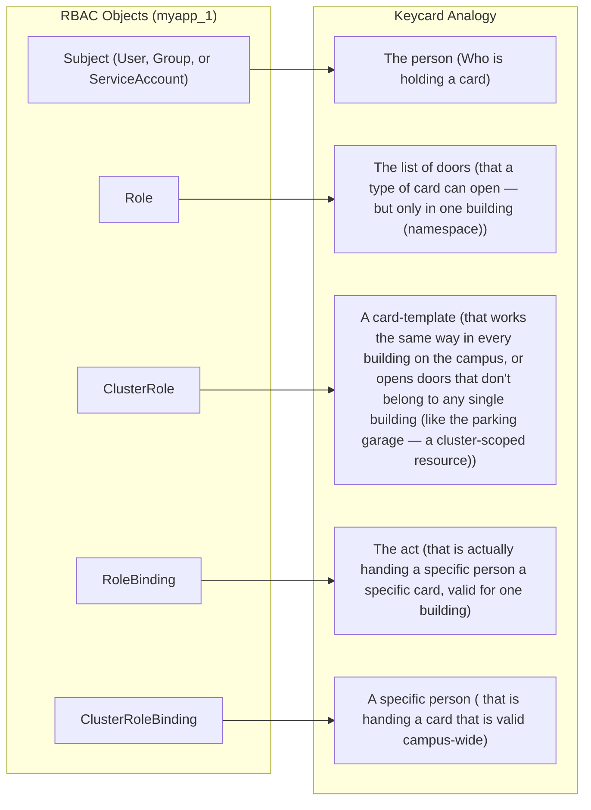
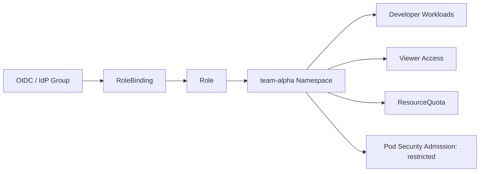
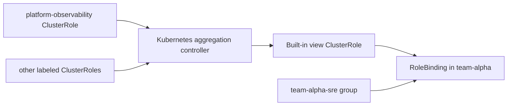

# Project Title: 
###  "Zero-Trust Multi-Tenant Kubernetes: Namespace-Scoped RBAC, Aggregated ClusterRoles, and Least-Privilege Service Accounts"

## Tool versions: 
 - Kubernetes 1.36 (RBAC API rbac.authorization.k8s.io/v1 — stable since 1.8, unchanged surface but the built-in default roles have shifted underneath it), 
 - kubectl 1.36.x, 
 - Pod Security Admission (stable, restricted/baseline/privileged standards), 
 - ValidatingAdmissionPolicy (GA since 1.30, CEL-based)

# What You Will Build
•	Two isolated tenant namespaces (team-alpha, team-beta) with namespace-scoped Role/RoleBinding pairs that give each team exactly what it needs and nothing else
•	A platform-level ClusterRole built the aggregated way — the pattern Kubernetes' own admin/edit/view roles use — instead of one giant hand-written rule list
•	Dedicated ServiceAccounts per application (never the namespace default SA), with automount disabled where it isn't needed
•	A live demonstration of a current, real gotcha in the built-in edit/admin roles that catches teams off guard in production
•	A full audit workflow using kubectl auth can-i and impersonation to prove what an identity can actually do — not what you think it can do

Check this : [How to run this tutorial](Playbook-How-to-run-this-tutorial.md) 

# What is multitenant Kubernetes? 
Multitenant Kubernetes means one Kubernetes cluster is shared by multiple tenants while still keeping their workloads, access, and resources separated enough for safety and control. A tenant can be a team, a project, or a customer in a SaaS platform.

## Core idea
In a single-tenant setup, one cluster is usually dedicated to one app or team. In a multitenant setup, several teams or customers share the same cluster, but Kubernetes policies limit what each tenant can see or do.

The main goal is to balance cost efficiency with isolation. That isolation is usually built with namespaces, RBAC, resource quotas, network policies, and pod security controls.

## Example
Imagine a company with two teams: payments and analytics. Both teams use the same Kubernetes cluster, but each gets its own namespace:
    . payments-ns
    . analytics-ns

Each namespace has:
    . Its own RBAC rules, so the payments team cannot modify analytics workloads.
    . Its own ResourceQuota, so one team cannot consume all CPU or memory.
    . Its own NetworkPolicies, so pods in one namespace cannot freely talk to the other.

So even though both teams share the same cluster, they are separated logically and operationally.

## Simple mental model
Think of the cluster like an apartment building. The building infrastructure is shared, but each tenant has a separate apartment, locked door, and usage limits. In Kubernetes, the cluster is the building, namespaces are the apartments, RBAC is the key system, and quotas are the utility limits.

## Common patterns
There are a few common ways to do multitenancy:
    . Namespace-per-tenant. Most common and practical for many internal platforms.
    . Cluster-per-tenant. Strongest isolation, but more expensive and harder to operate.
    . Shared cluster with virtual clusters or tenant operators. Useful when you want stronger isolation without fully 
      separate clusters.

# The RBAC Mental Model (in plain language)

Think of it like a building's keycard system, because that's really what it is:

### RBAC object	& Keycard analogy


```mermaid
flowchart LR
    subgraph RBACobject["RBAC Objects (myapp_1)"]
        RBACobject1["Subject (User, Group, or ServiceAccount)"]
        RBACobject2["Role"]
        RBACobject3["ClusterRole"]
        RBACobject4["RoleBinding"]
        RBACobject5["ClusterRoleBinding"]
    end

    subgraph Keycard["Keycard Analogy"]
        KeycardAttr1["The person (Who is holding a card)"]
        KeycardAttr2["The list of doors (that a type of card can open — but only in one building (namespace))"]
        KeycardAttr3["A card-template (that works the same way in every building on the campus, or opens doors that don't belong to any single building (like the parking garage — a cluster-scoped resource))"]
        KeycardAttr4["The act (that is actually handing a specific person a specific card, valid for one building)"]
        KeycardAttr5["A specific person ( that is handing a card that is valid campus-wide)"]
    end

    RBACobject1 --> KeycardAttr1
    RBACobject2 --> KeycardAttr2
    RBACobject3 --> KeycardAttr3
    RBACobject4 --> KeycardAttr4
    RBACobject5 --> KeycardAttr5
```
---

## Four things to memorize because they're the four ways people get RBAC wrong:
1.	A Role with no RoleBinding does nothing. It's a card design sitting in a 
drawer — nobody's holding it.
2.	A ClusterRole is just a template until it's bound. You can bind a ClusterRole 
with a RoleBinding (not just a ClusterRoleBinding) — that gives the cluster-wide 
permission list but scoped down to one namespace's doors only. This is the single 
most useful and most under-used pattern in RBAC.
3.	RBAC is purely additive. There is no "deny" rule. You cannot subtract a permission 
with a second binding — you can only ever grant more. If you want to restrict, you 
write a narrower Role, you don't try to negate a broader one.
4.	ClusterRoleBinding bypasses every namespace boundary you've built. Every one 
in your cluster deserves a code-review-level look, because it's the one object that 
ignores everything else in this tutorial.

### Architecture


```mermaid
flowchart LR
  IdP[OIDC / IdP Group] --> RB[RoleBinding]
  RB --> R[Role]
  R --> NS[team-alpha Namespace]
  NS --> W1[Developer Workloads]
  NS --> W2[Viewer Access]
  NS --> Q[ResourceQuota]
  NS --> PSA[Pod Security Admission: restricted]
```

### Why this matters

A `Role` is namespace-scoped, while a `ClusterRole` is reusable across namespaces 
and can also support cluster-scoped permissions . Kubernetes built-in user-facing 
ClusterRoles include `cluster-admin`, `admin`, `edit`, and `view`, and they are 
designed to be extended through aggregation instead of rewriting them directly.

A fresh ServiceAccount does not automatically get broad permissions. Kubernetes 
default RBAC is intentionally restrictive, so access must be granted explicitly 
through a binding [web:68][web:79].

### RBAC building blocks

| Object                | Scope                                  | Purpose                                    |
|                       |                                        |                                            |
| `Role`                | Namespace                              | Defines permissions inside one namespace   |
| `RoleBinding`         | Namespace                              | Grants a `Role` or `ClusterRole` to a user,| 
|                       |                                        |      group, or ServiceAccount              |
| `ClusterRole`         | Cluster-wide or reusable               | Defines permissions that can be reused     | 
|                       |                                        |      across namespaces                     |
| `ClusterRoleBinding`  | Cluster-wide                           | Grants a `ClusterRole` cluster-wide        |
|                       |                                        |                                            |


### Example: developer Role
```yaml
apiVersion: rbac.authorization.k8s.io/v1
kind: Role
metadata:
  name: developer
  namespace: team-alpha
rules:
  - apiGroups: ["", "apps", "batch"]
    resources: ["pods", "deployments", "replicasets", "services", "configmaps", "jobs", "cronjobs"]
    verbs: ["get", "list", "watch", "create", "update", "patch", "delete"]
  - apiGroups: [""]
    resources: ["pods/log", "pods/exec"]
    verbs: ["get", "create"]
  - apiGroups: [""]
    resources: ["secrets"]
    verbs: ["get", "list"]
  - apiGroups: [""]
    resources: ["events"]
    verbs: ["get", "list", "watch"]
```
This Role is namespace-scoped, so it only works inside `team-alpha`. 
The `pods/exec` and `pods/log` subresources are included explicitly 
because subresources are controlled separately in RBAC.

### Example: developer binding

```yaml
apiVersion: rbac.authorization.k8s.io/v1
kind: RoleBinding
metadata:
  name: developer-binding
  namespace: team-alpha
subjects:
  - kind: Group
    name: team-alpha-developers
    apiGroup: rbac.authorization.k8s.io
roleRef:
  kind: Role
  name: developer
  apiGroup: rbac.authorization.k8s.io
```

This binding maps an external identity group, such as an OIDC group, 
to the namespace Role. 
That makes onboarding and offboarding a group-management task in the 
identity provider instead of a cluster change.

## ClusterRoles, Aggregation, and a Production Gotcha

Kubernetes RBAC has two important building blocks for platform access control: 
    `Role` and `ClusterRole`. 

A `Role` is namespace-scoped, while a `ClusterRole` can be reused across 
namespaces and can also include cluster-scoped permissions.

## Built-in user-facing ClusterRoles
Kubernetes ships with four built-in user-facing ClusterRoles: 
    1. `cluster-admin`, 
    2. `admin`, 
    3. `edit`, 
    4. `view`

These roles are intentionally not “full access” in every case, because 
Kubernetes applies least-privilege defaults and only grants access where 
it is explicitly bound.

### How the built-in roles work

A fresh `ServiceAccount` does not automatically inherit broad permissions. 
By default, Kubernetes keeps access narrow unless you attach a `RoleBinding` 
or `ClusterRoleBinding` explicitly.

This is an important security principle for multi-tenant clusters: if a 
workload can access more than expected, that access was granted intentionally 
through RBAC and not inherited by accident.

### The EndpointSlice gotcha

One production detail that is easy to miss is that `EndpointSlice` access 
is deliberately excluded from the default `admin` and `edit` roles. This 
is a security decision, because modifying EndpointSlices can influence 
traffic routing and can expose backend IPs or bypass intended isolation 
controls.

So in practice, `edit` does **not** mean “complete namespace control.” 
It is powerful, but not universal, and `EndpointSlice` is a clear example 
of a resource that stays restricted by design.

### Aggregated ClusterRoles

Kubernetes uses ClusterRole aggregation to compose higher-level permissions 
from smaller, labeled ClusterRoles. Instead of maintaining one huge role, 
you create smaller roles and label them so the controller merges them into 
built-in roles such as `admin`, `edit`, or `view` automatically.

This approach keeps RBAC modular and easier to maintain. It is especially useful 
for extending built-in access with custom resources or platform-specific APIs 
without editing the default roles directly.

### Example

If you want the built-in `view` role to include read access to a custom resource 
named `widgets`, you can create a small ClusterRole like this:

```yaml
apiVersion: rbac.authorization.k8s.io/v1
kind: ClusterRole
metadata:
  name: widget-viewer
  labels:
    rbac.authorization.k8s.io/aggregate-to-view: "true"
rules:
  - apiGroups: ["example.com"]
    resources: ["widgets"]
    verbs: ["get", "list", "watch"]
```

Kubernetes will automatically merge those rules into the aggregated `view` role.

### Why this matters in production

This design helps platform teams keep access predictable, reusable, and auditable. 
It also prevents accidental over-permissioning, which is especially important in 
shared clusters and namespace-scoped multi-tenant environments .

### Diagram


```mermaid
flowchart LR
  CR1[platform-observability ClusterRole]
  CR2[other labeled ClusterRoles]
  AGG[Kubernetes aggregation controller]
  VIEW[Built-in view ClusterRole]
  RB[RoleBinding in team-alpha]
  GROUP[team-alpha-sre group]

  CR1 --> AGG
  CR2 --> AGG
  AGG --> VIEW
  VIEW --> RB
  GROUP --> RB
```

### Example: platform observability ClusterRole

```yaml
apiVersion: rbac.authorization.k8s.io/v1
kind: ClusterRole
metadata:
  name: platform-observability
  labels:
    rbac.authorization.k8s.io/aggregate-to-view: "true"
rules:
  - apiGroups: ["metrics.k8s.io"]
    resources: ["pods", "nodes"]
    verbs: ["get", "list"]
  - apiGroups: ["monitoring.coreos.com"]
    resources: ["prometheusrules", "servicemonitors"]
    verbs: ["get", "list", "watch"]
```

This ClusterRole does not need to be bound directly to users. 
Because it has the `aggregate-to-view` label, Kubernetes merges 
its rules into the built-in `view` ClusterRole.

### Example: namespace RoleBinding using the extended view

```yaml
apiVersion: rbac.authorization.k8s.io/v1
kind: RoleBinding
metadata:
  name: view-plus-observability
  namespace: team-alpha
subjects:
  - kind: Group
    name: team-alpha-sre
    apiGroup: rbac.authorization.k8s.io
roleRef:
  kind: ClusterRole
  name: view
  apiGroup: rbac.authorization.k8s.io
```

**Key idea:** define small permission blocks, label them for aggregation, 
and let Kubernetes compose the final access model automatically.

### Important production note

When you use aggregation, always verify the resulting permissions after 
applying manifests. The cluster controller must be able to match labels 
correctly, and a typo in the selector or a missing ClusterRole can leave 
the aggregated role with no effective rules. That is why 
checking the final role is important in real clusters.

## Quota
### Example: namespace security

```yaml
apiVersion: v1
kind: ResourceQuota
metadata:
  name: team-alpha-quota
  namespace: team-alpha
spec:
  hard:
    requests.cpu: "8"
    requests.memory: 16Gi
    limits.cpu: "16"
    limits.memory: 32Gi
    pods: "40"
    persistentvolumeclaims: "10"
```
This quota limits how much compute, memory, pod count, and PVC usage 
the namespace can consume. When quotas are enforced for CPU and memory, 
pods usually need matching requests or limits, otherwise admission may 
reject them.

## ServiceAccount Philosophy: No Token by Default, Separate Bot for API Ops
This project follows a simple but strong ServiceAccount strategy:

  - **Application pods do not get API tokens by default.**
  - **Automation that needs API access uses a separate, narrowly scoped ServiceAccount.**

Most workloads never call the Kubernetes API directly, so mounting a token only adds attack 
surface without benefit. By disabling automatic token mounting and using dedicated ServiceAccounts, 
we reduce the chance of credential theft from compromised pods.

#### Philosophy summary

- **No token by default for app pods.** Application ServiceAccounts set `automountServiceAccountToken: false` and deployments explicitly reference them.
- **Separate bot ServiceAccount for API ops.** A dedicated ServiceAccount like `deploy-bot` is bound to a narrowly scoped Role, giving it only the permissions required for rollout operations.
- **Least privilege everywhere.** Application pods cannot reach the API accidentally, and automation cannot change more than it needs to.
- 
#### 1. Per-application ServiceAccount with no token
Check `myapp-serviceaccount.yaml`

This ServiceAccount belongs to the `myapp` application and has `automountServiceAccountToken: false`, so any pod using it will not receive a Kubernetes API token mount by default.

Check `myapp-deployment-snippet.yaml`
The deployment:

- Explicitly sets `serviceAccountName: myapp` instead of relying on the `default` ServiceAccount.
- Repeats `automountServiceAccountToken: false` at the pod spec level for extra safety.

Together, these two manifests ensure `myapp` runs without a mounted API token unless you deliberately add one.

#### 2. Separate deploy-bot ServiceAccount for API operations

For the minority of pods that genuinely need API access (operators, controllers, CI/CD bots), this project uses a **separate ServiceAccount** plus a tightly scoped Role.

Check : `deploy-bot-role.yaml`:

This Role allows:

- `get` and `list` deployments for introspection.
- `patch` deployments, which is enough to bump an annotation and trigger a rollout, but not to fully replace the spec.

Check `deploy-bot-binding.yaml`:

This RoleBinding:

- Attaches the `deployment-restarter` Role to the `deploy-bot` ServiceAccount in `team-alpha`.
- Grants only the minimal deployment restart capability to that bot, and to nothing else.

You also define the `deploy-bot` ServiceAccount itself (for example):

This ServiceAccount is allowed to have an API token because its purpose is automation that talks to the Kubernetes API.

## Namespace Isolation as Defense-in-Depth

Namespace isolation in Kubernetes is not a single switch; it is a **stack of controls** that work together. RBAC alone only guards API actions. It does not stop a running pod from talking to other namespaces over the network, running as root, or consuming all available resources.

A properly isolated tenant namespace layers at least four mechanisms:

1. **RBAC (who can act).**  
   Controls which users, groups, or ServiceAccounts can create, modify, or delete API objects in the namespace [web:68][web:151].

2. **Pod Security Admission (what workloads can be).**  
   Enforces Pod Security Standards such as `restricted` via namespace labels, limiting how pods are configured (user IDs, capabilities, host access, etc.).

3. **ResourceQuota / LimitRange (how much they can consume).**  
   Caps namespace-wide CPU, memory, pod count, and storage usage, and sets sensible defaults so a single untuned pod cannot exhaust the entire namespace.

4. **NetworkPolicy (who can talk to whom).**  
   Restricts ingress and egress traffic so pods cannot freely communicate across namespaces or to the internet without explicit allow rules.

Each layer addresses a different part of the threat model. Missing any one of them gives you the *appearance* of isolation, not the reality.

### ValidatingAdmissionPolicy: rules at admission time

Beyond these four layers, Kubernetes now includes `ValidatingAdmissionPolicy`, which lets you define cluster-wide or per-namespace admission rules using CEL expressions.

#### ValidatingAdmissionPolicy and CEL Expressions

Kubernetes uses **Common Expression Language (CEL)** inside `ValidatingAdmissionPolicy` to enforce admission-time rules without external webhooks. CEL is a small, safe expression language designed for evaluating boolean conditions over resource data (like Pod specs).

#### Example 1: Require resource requests and limits for all tenant pods

The following example policy requires every container in a Pod to define both `resources.requests` 
and `resources.limits`. This aligns with a multi-tenant, namespace-scoped model where tenants must 
declare resource budgets.

```yaml
apiVersion: admissionregistration.k8s.io/v1
kind: ValidatingAdmissionPolicy
metadata:
  name: require-resources-for-pods
spec:
  paramKind:
    apiVersion: v1
    kind: ConfigMap
  matchConstraints:
    resourceRules:
      - apiGroups: [""]
        apiVersions: ["v1"]
        operations: ["CREATE", "UPDATE"]
        resources: ["pods"]
  validations:
    - expression: >
        object.spec.containers.all(c,
          has(c.resources) &&
          has(c.resources.requests) &&
          has(c.resources.limits)
        )
      message: "All containers must define resources.requests and resources.limits."
      reason: "Invalid"
```

Key points:

- `object` in the expression is the incoming Pod object.
- `object.spec.containers.all(...)` iterates over all containers using CEL’s `all` helper.
- `has(c.resources.requests)` and `has(c.resources.limits)` ensure both are set.

To make this policy configurable per namespace, you can use a parameter ConfigMap and a binding:
Example 2:
```yaml
apiVersion: v1
kind: ConfigMap
metadata:
  name: tenant-pod-policy
  namespace: team-alpha
data:
  enforceResources: "true"
```

```yaml
apiVersion: admissionregistration.k8s.io/v1
kind: ValidatingAdmissionPolicyBinding
metadata:
  name: require-resources-for-pods-binding
spec:
  policyName: require-resources-for-pods
  paramRef:
    name: tenant-pod-policy
    # No namespace here: API server will look for the ConfigMap
    # in the namespace of the incoming Pod request[1][2]
  validationActions: ["Deny"]
```

This setup lets you:
- Scope the policy to namespaces via parameters.
- Keep rules in-tree with CEL instead of running a separate Kyverno/OPA controller [web:155][web:159].

Key points:

- The **policy** defines the CEL validation logic (for example, “no `latest` image tags” or “all pods must set resource limits”).
- A **parameter resource** (CRD or ConfigMap) can provide namespace-specific values.
- The **binding** activates the policy and uses `paramRef` to select the parameter resource; if you omit the namespace on `paramRef`, the API server looks for parameters in the same namespace as the incoming request.

In practice, this gives you an in-tree alternative to tools like Kyverno or OPA for admission-time checks without maintaining a separate webhook controller .

#### Two distinct enforcement points

It is useful to distinguish two different enforcement points in Kubernetes:

- **RBAC decides who can attempt an action.**  
  It answers “Is this subject allowed to create or modify this resource at all?”.

- **ValidatingAdmissionPolicy decides whether the action is allowed to succeed.**  
  It answers “Regardless of who is asking, does this resource configuration meet our policy?”.

## Auditing What an Identity Can Actually Do

I do not trust RBAC YAML in isolation; I verify effective permissions using `kubectl auth can-i` and RBAC plugins. This is part of my defense-in-depth approach to multi-tenant clusters.

### Targeted checks with kubectl auth can-i

Example: check whether the `deploy-bot` ServiceAccount can delete deployments in `team-alpha`:

```bash
kubectl auth can-i delete deployments \
  --as=system:serviceaccount:team-alpha:deploy-bot \
  -n team-alpha
# Expected: "no" — the Role only grants get/list/patch
```

List all effective permissions for `deploy-bot` in `team-alpha`:

```bash
kubectl auth can-i --list \
  --as=system:serviceaccount:team-alpha:deploy-bot \
  -n team-alpha
```

Check whether the `team-alpha-developers` group can create secrets:

```bash
kubectl auth can-i create secrets \
  --as=someone@example.com \
  --as-group=team-alpha-developers \
  -n team-alpha
```

Cross-namespace leak check — this **must** return `no` to avoid tenant breakout:

```bash
kubectl auth can-i get pods \
  --as=system:serviceaccount:team-alpha:deploy-bot \
  -n team-beta
```

These checks validate that the RBAC configuration matches the intended least-privilege design and that service accounts cannot escape their tenant namespace.

#### Using RBAC plugins: rbac-lookup and who-can

I also use krew plugins to audit permissions more broadly:

```bash
kubectl krew install rbac-lookup
kubectl krew install who-can
```

Find all bindings for the `deploy-bot` ServiceAccount across the cluster:

```bash
kubectl rbac-lookup deploy-bot --kind serviceaccount
```

Reverse lookup: who can delete deployments in `team-alpha`?

```bash
kubectl who-can delete deployments -n team-alpha
```

These tools let me answer:

- “Which Roles and RoleBindings are attached to this identity?”
- “Who can perform a sensitive action in this namespace?”

Together with `kubectl auth can-i`, this forms a repeatable RBAC audit workflow that I can run in CI or as part of periodic security reviews.

### RBAC Audit Checklist

I treat RBAC as something to **prove**, not just configure. This checklist shows how I audit what identities can actually do in a cluster using `kubectl auth can-i` and RBAC-focused plugins.

#### 1. Verify sensitive ServiceAccounts

- Can the `deploy-bot` ServiceAccount delete deployments in `team-alpha`?

  ```bash
  kubectl auth can-i delete deployments \
    --as=system:serviceaccount:team-alpha:deploy-bot \
    -n team-alpha
  # Expected: "no" — Role only grants get/list/patch
  ```

- List all effective permissions for `deploy-bot` in `team-alpha`:

  ```bash
  kubectl auth can-i --list \
    --as=system:serviceaccount:team-alpha:deploy-bot \
    -n team-alpha
  ```

These checks validate that automation bots have only the minimum required privileges.

#### 2. Validate group-based privileges

- Does the `team-alpha-developers` group have secret-write access?

  ```bash
  kubectl auth can-i create secrets \
    --as=someone@example.com \
    --as-group=team-alpha-developers \
    -n team-alpha
  ```

This helps confirm that developer groups cannot mint or modify secrets unexpectedly, which is a key least-privilege control.

#### 3. Check cross-namespace isolation

- Cross-namespace leak check — must return `no`:

  ```bash
  kubectl auth can-i get pods \
    --as=system:serviceaccount:team-alpha:deploy-bot \
    -n team-beta
  ```

If this ever returns `yes`, it indicates a tenant breakout risk and needs immediate investigation [web:149][web:151].

#### 4. Use RBAC plugins for broader review

Install RBAC auditing plugins via krew:

```bash
kubectl krew install rbac-lookup
kubectl krew install who-can
```

Then:

- Find bindings for the `deploy-bot` ServiceAccount across the cluster:

  ```bash
  kubectl rbac-lookup deploy-bot --kind serviceaccount
  ```

- Reverse lookup: who can delete deployments in `team-alpha`?

  ```bash
  kubectl who-can delete deployments -n team-alpha
  ```

These commands answer “what is bound to this identity?” and “who can perform this action?” and are useful during periodic security reviews [web:167][web:170].

#### 5. Run the checklist regularly

I run these checks:

- After RBAC changes.
- Before onboarding a new team or tenant namespace.
- As part of periodic security reviews in production clusters.

This keeps RBAC aligned with least-privilege goals and makes it easier to demonstrate access controls in audits and interviews .